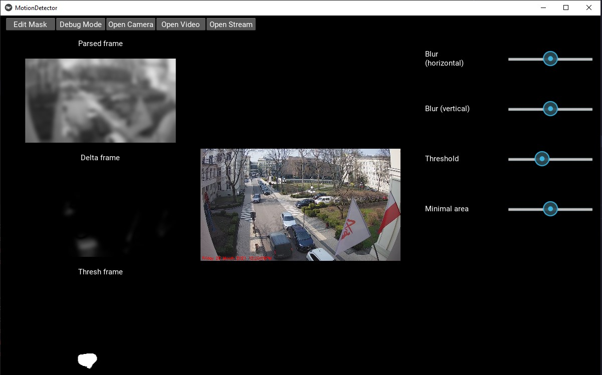
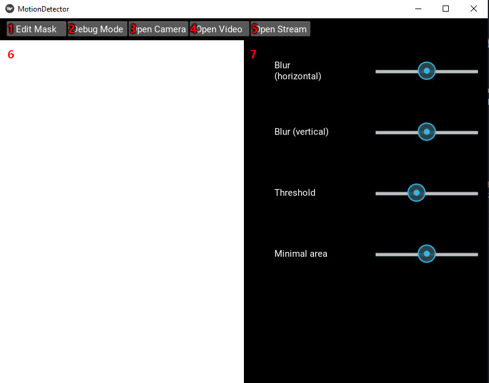

# System Wykrywania Ruchu
Autorzy: Iwo Plaza, Mateusz Zalewski, Krzysztof Faracik

## Cel
Aplikacja umożliwia odtwarzanie oraz wyświetlanie sekwencji wideo z pliku, urządzenia wejściowego audio (kamery)
lub strumienia z kamery online. Przy pomocy algorytmu, na każdej klatce zostają zaznaczone miejsca, w których
został wykryty ruch względem poprzednich klatek. Możliwa jest edycja parametrów wykrywania ruchu takich jak
minimalne pole obszaru detekcji, oraz zmiana czułości samej detekcji.

W razie wykrycia ruchu program rozpoczyna zapis pliku wideo do pliku o nazwie odpowiadającej dacie oraz
godzinie wystąpienia ruchu.

## Funkcjonalności

### Podstawowe funkcjonalności systemu
- możliwość ustalenia źródła sekwencji video (strumień z kamery, plik video, itp.)
- wyświetlanie w czasie rzeczywistym sekwencji video
- określanie obszarów czułości (maski) w których ma działać detekcja ruchu
- informowanie o wystąpieniu ruchu w sposób wizualny (np. wyświetlany tekst, zaznaczenie kolorową ramką, itp.)
- możliwość określenia czułości systemu na pojawiający się ruch (zmiany), tak aby wyeliminować np. drobne zmian (padający deszcz lub śnieg, zmiany oświetlenia, itp.)
- możliwość włączenia trybu 'debug', w którym wizualizowane będą poszczególne etapy przetwarzania obrazu (np. konwersja z RGB/YUV na odcienie szarości, binaryzacja, wynik operacji odejmowania klatki bieżącej i referencyjnej, itd.)

 ### Dodatkowe funkcjonalności
- nagrywanie do pliku w przypadku wykrycia ruchu.
- wiele współbierznych częstotliwości wykrywania. ([Więcej o...](#frequencies))

## Instalacja
Do uruchomienia aplikacji niezbędne są następujące biblioteki (których spis znaleźć można w pliku requirements.txt):

- Python 3
- opencv-python 4.5.1.48
- cycler 0.10.0
- kiwisolver 1.3.1
- matplotlib 3.3.4
- numpy 1.20.1
- opencv-python 4.5.1.48
- Pillow 8.1.2
- pyparsing 2.4.7
- python-dateutil 2.8.1
- six 1.15.0

Korzystając ze środowiska PyCharm możemy zaimportować biblioteki przechodząc do 
File -> Settings -> Project:motion-detector -> Python Interpreter -> “+” oraz wpisać nazwy brakujących bibliotek (w odpowiedniej wersji).

## Algorytm detekcji ruchu
Zaimplementowany przez nas algorytm wykrywania ruchu, korzysta z funkcji biblioteki OpenCV.
Może on zostać podzielony na 5 główne etapy:
- Przetworzenie klatki wejściowej
- zmniejszenie rozdzielczości
- konwersja koloru na skalę szarości (cv2.cvtColor(,cv2.COLOR_BGR2GRAY)
- zastosowanie rozmycia gaussowskiego (cv2.GaussianBlur)
- Wyznaczenie różnicy klatki bieżącej i klatki referencyjnej (cv2.absdiff)
- Przemnożenie różnicy przez wybraną maskę czułości (cv2.multiply)
- Binaryzacja otrzymanej różnicy względem edytowalnej wartości progowej  (cv2.threshold)
- Na koniec otrzymaną mapę bitową rozszerzamy (cv.dilate), by uprościć kształt wyznaczonej różnicy
- Wyznaczenie obszarów różnicy (cv2.findContours) oraz odfiltrowanie tych, których powierzchnia jest zbyt mała.

### Współbierzne częstotliwości detekcji 
Przechowywane są 3 klatki referencyjne o różnym czasie aktualizacji, domyślnie 1, 5 i 10 sekund.
W każdej iteracji algorytmu, rozważana klatka porównywana jest do klatki wczytanej sprzed 1,5 oraz 10 sekund,
a znalezione różnice są na siebie nakładane. Podejście to pozwala na wykrywanie zmian zarówno gwałtownych, jak i
powolnych (np. powoli skradający się człowiek).

## Krótka instrukcja użytkowania

### Okno główne
Aplikację uruchamiamy otwierając plik `app.py` przy pomocy Pythona zainstalowawszy wcześniej wszystkie wymagane biblioteki.
Ukaże się okno główne, z którego będziemy mogli otworzyć wykrywanie z różnych źródeł:
- kamera (3),
- plik wideo (4),
- strumień video (5),

**Przycisk 'Edit Mask'** (1) otwiera panel [Edytor maski](#edytor-maski).

**Przycisk 'Debug Mode'** (2) otwiera/zamyka panel [Debug](#okno-debug).

**Panel widoku** (6) odpowiada za podgląd źródła na którym, przeprowadzamy detekcję oraz podgląd obszarów wykrytego ruchu.

### Panel ustawień
Panel ustawień (7) pozwala użytkownikowi dostosować parametry wykrycia:
- **Blur (horizontal)** - poziom rozmycia obrazu w osi X
- **Blur (vertical)** - poziom rozmycia obrazu w osi Y
- **Threshold** - wartość progowa binaryzacji obrazu (im niższa, tym zmiany o mniejszej wartości pomiędzy klatkami 
                  są wykrywane)
- **Minimal area** - minimalne pole powierzchni obszaru na którym został wykryty ruch (im mniejsze, tym mniejsze poruszające się obiekty mogą zostać wykryte)

### Okno debug 
Pokazuje etapy pośrednie działania algorytmu.
Od góry:
- najbardziej aktualna klatka referencyjna 
- różnica klatki aktualnej i klatki referencyjnej przemnożona przez maskę czułości
- mapa bitowa ruchu.

### Edytor maski 
Pozwala na narysowanie oraz zaaplikowanie maski czułości. Przy pomocy znajdujących się w dolnej części suwaków,
możliwa jest zmiana wielkości oraz nasycenia pisaka, którym to przeciągając po kanwie, rysowana jest maska. 
Kolor **biały** oznacza, że ruch w danej części obrazu będzie wykrywane, a kolor **czarny** oznacza brak czułości na ruch.
